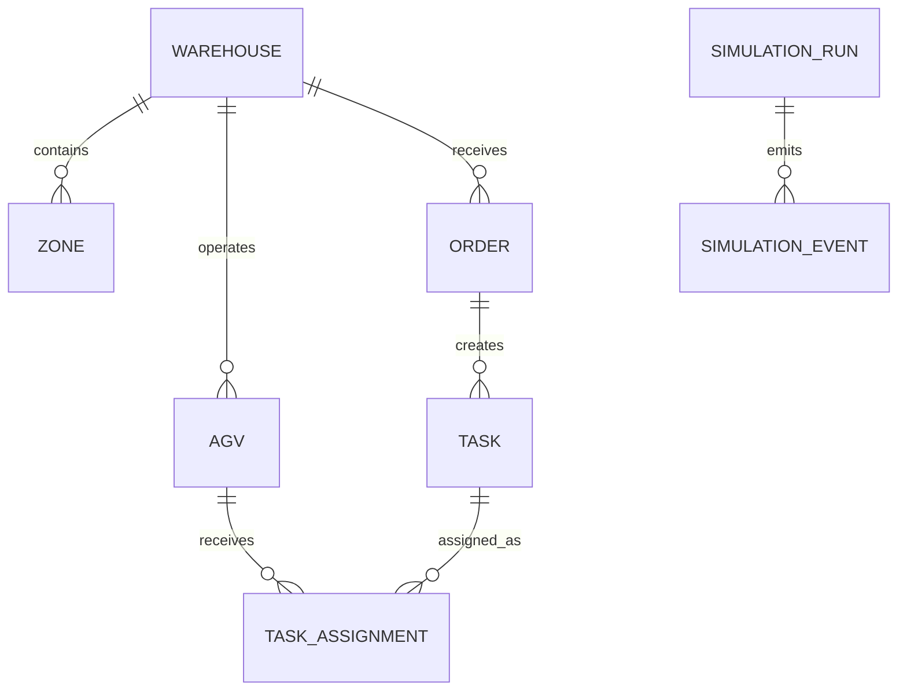

# ER Diagram (initial conceptual model)

```mermaid
erDiagram
  WAREHOUSE ||--o{ ZONE : contains
  WAREHOUSE ||--o{ AGV : operates
  WAREHOUSE ||--o{ ORDER : receives
  ORDER ||--o{ TASK : creates
  AGV ||--o{ TASK_ASSIGNMENT : receives
  TASK ||--o{ TASK_ASSIGNMENT : assigned_as
  SIMULATION_RUN ||--o{ SIMULATION_EVENT : emits
```

This is a target conceptual model; only the initial warehouse, AGV and task tables are scaffolded in SQLAlchemy today.
